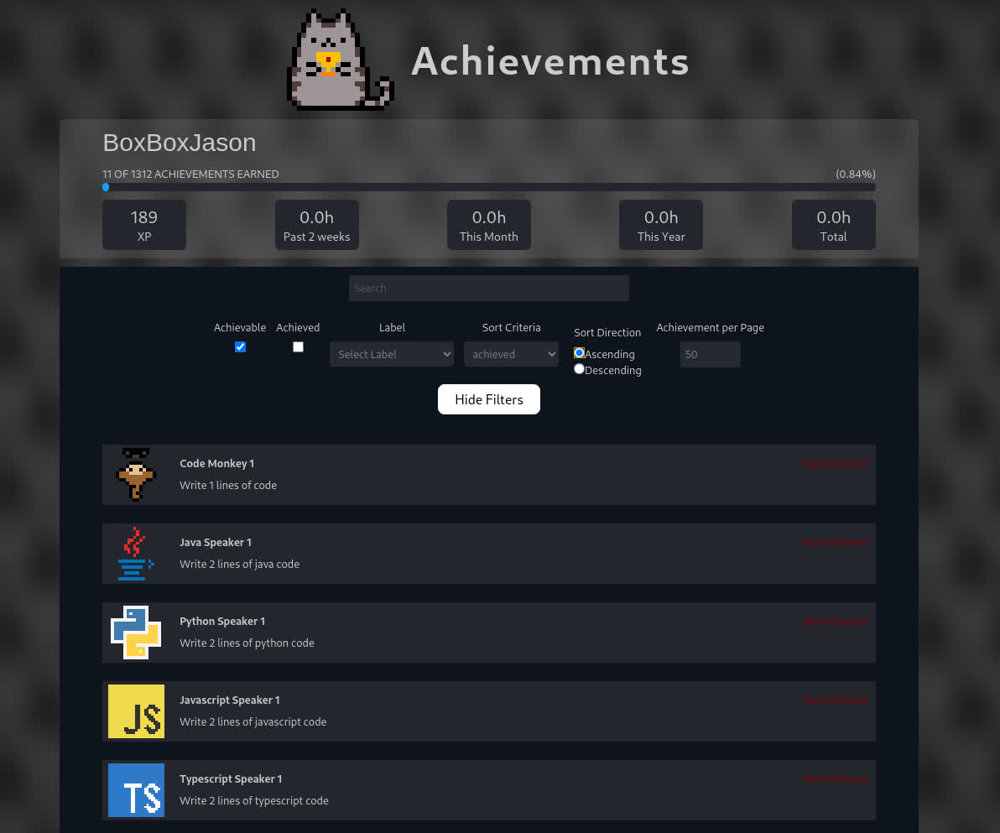

# Achievements

Achievements is a Visual Studio Code extension that allows you to track your progress in coding, and earn achievements for completing tasks.

## Features

- Track your progress in coding
- Earn achievements for completing tasks
- View your achievements in the **Achievements** panel
- View each achievement's description and requirements
- View your progress towards each achievement
- Track your time spent coding
- Filter achievements by category, progress, and name
- View your profile and completion percentage
- Enable or disable notifications
- Enable or disable any type of listeners for **privacy**

## Extension Commands

Several commands are available to interact with the Achievements extension. You can access these commands through the Command Palette (Ctrl+Shift+P) or by using keybindings.

|Command|Description|
|---|---|
|`achievements.enable`|Enable or Disable the Achievements extension event tracking (requires a restart)|
|`achievements.settings`|Open the Achievements configuration page|
|`achievements.show`|Show the Achievements panel|

## Configuration

The Achievements extension can be configured through the settings. You can access the settings by going to **File > Preferences > Settings** and searching for "Achievements".
You can also access the settings by using the command `achievements.settings`.

|Setting|Description|
|---|---|
|`achievements.enabled`|Enable or disable the Achievements extension event tracking|
|`achievements.notifications`|Enable or disable notifications for achievements|
|`achievements.logDirectory`|Select the directory where the log files will be stored|
|`achievements.logLevel`|Select the log level (info, debug, error)|
|`achievements.username`|Define your username for the Achievements score display|
|`achievements.listeners.debug`|Enable or disable debug listeners|
|`achievements.listeners.git`|Enable or disable git listeners|
|`achievements.listeners.extensions`|Enable or disable extension listeners|
|`achievements.listeners.files`|Enable or disable file listeners|
|`achievements.listeners.tabs`|Enable or disable tab listeners|
|`achievements.listeners.tasks`|Enable or disable task listeners|
|`achievements.listeners.time`|Enable or disable time tracking listeners|

## Installation

### From VSIX

1. Download and install [Visual Studio Code](https://code.visualstudio.com/).
2. Download and install the [Achievements Extension VSIX](https://github.com/boxboxjason/achievements/releases) from the GitHub releases page.
3. Open Visual Studio Code. Go to the Extensions view by clicking on the Extensions icon in the Activity Bar on the side of the window or by pressing `Ctrl+Shift+X`.
4. Click on the three-dot menu icon in the top-right corner of the Extensions view and select "Install from VSIX...".
5. In the file dialog that appears, navigate to the location where you downloaded the Achievements Extension VSIX file, select it, and click "Open".
6. Visual Studio Code will install the extension. Once the installation is complete, you may need to reload Visual Studio Code for the extension to be activated. You can do this by clicking the "Reload" button that appears in the Extensions view after installation or by closing and reopening Visual Studio Code.
7. Run the command `Achievements: Show` from the Command Palette (`Ctrl+Shift+P`) to open the Achievements panel.
