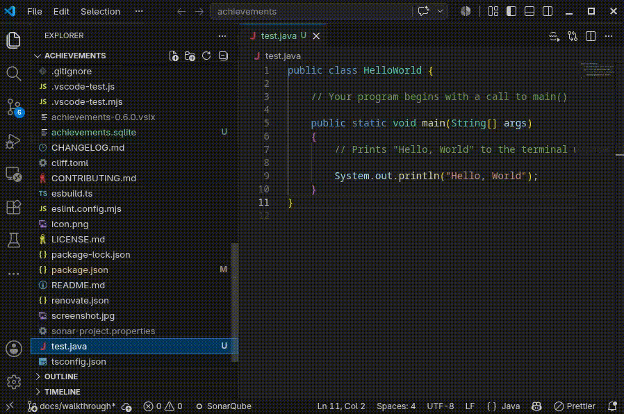

# Achievements

[](https://open-vsx.org/extension/BoxBoxJason/achievements)

Achievements is a Visual Studio Code extension that allows you to track your progress in coding, and earn achievements for completing tasks.



> [!WARNING]
> This extension is in beta, may contain bugs and database schema may change in future versions.
> It is recommended to back up your data before updating.

## Features

- Track your progress in coding
- Earn achievements for completing tasks
- View your achievements in the **Achievements** panel
- View each achievement's description and requirements
- View your progress towards each achievement
- Track your time spent coding
- Filter achievements by category, progress, and name
- View your profile and completion percentage
- Enable or disable notifications
- Enable or disable any type of listeners for **privacy**

## How it works

- The extension activates on `onStartupFinished` and listens to VS Code and Git events (based on your settings).
- Progress and achievement state are stored locally in a SQLite database powered by `sql.js` (no server).
- The UI is a VS Code webview (React) opened via **Achievements: Show**.

### Local data & read-only mode

- Data is stored under VS Code's global storage as `achievements.sqlite`.
- A lock prevents multiple VS Code instances from writing the database at the same time.
  - If another instance is using the DB, the extension runs in **read-only** mode: listeners are disabled and a status bar item indicates the state.

### Sharing progress across devcontainers

When VS Code connects to a devcontainer, `achievements.sqlite` is stored inside the container's filesystem, at a path determined by the extension ID: `~/.vscode-server/data/User/globalStorage/boxboxjason.achievements/achievements.sqlite`

That path is deterministic across every devcontainer you connect to, so you can persist and share progress between containers (and across rebuilds) by mounting a host directory or named Docker volume at that exact location in `.devcontainer/devcontainer.json`:

```jsonc
{
  "mounts": [
    "source=${localEnv:HOME}/.achievements-data,target=/home/vscode/.vscode-server/data/User/globalStorage/boxboxjason.achievements,type=bind"
  ]
}
```

Adjust the remote user's home directory in `target` to match your container image (e.g. `/root` instead of `/home/vscode`), and use the same `source` across devcontainer configs to share one database between all of them.

> **Note:** only open one devcontainer at a time against a shared database. The write lock file
> lives under the container's own temp directory rather than next to the database, so two
> containers open simultaneously against the same mounted database won't see each other's lock
> and could both attempt to write at once.

### Network access

By default, this extension makes **no network requests** and works fully offline.

The only exception is the optional `achievements.checkOutdatedExtensions` setting (disabled by default). When enabled, it periodically sends the IDs of your installed (non-builtin) extensions to the VS Marketplace (`marketplace.visualstudio.com`) to check for outdated versions and award related achievements. Enable it only if you're comfortable sharing your installed-extension list with the Marketplace.

## Extension Commands

Several commands are available to interact with the Achievements extension. You can access these commands through the Command Palette (Ctrl+Shift+P) or by using keybindings.

|Command|Description|
|---|---|
|`achievements.enable`|Enable or Disable the Achievements extension event tracking (requires a restart)|
|`achievements.settings`|Open the Achievements configuration page|
|`achievements.show`|Show the Achievements panel|

## Configuration

The Achievements extension can be configured through the settings. You can access the settings by going to **File > Preferences > Settings** and searching for "Achievements".
You can also access the settings by using the command `achievements.settings`.

|Setting|Description|
|---|---|
|`achievements.enabled`|Enable or disable the Achievements extension event tracking|
|`achievements.notifications`|Enable or disable notifications for achievements|
|`achievements.logDirectory`|Select the directory where the log files will be stored|
|`achievements.logLevel`|Select the log level (info, debug, error)|
|`achievements.username`|Define your username for the Achievements score display|
|`achievements.listeners.debug`|Enable or disable debug listeners|
|`achievements.listeners.git`|Enable or disable git listeners|
|`achievements.listeners.extensions`|Enable or disable extension listeners|
|`achievements.checkOutdatedExtensions`|Opt-in: check installed extensions against the VS Marketplace for outdated versions (sends your installed extension IDs over the network; disabled by default)|
|`achievements.listeners.files`|Enable or disable file listeners|
|`achievements.listeners.shortcuts`|Enable or disable paste shortcut listeners|
|`achievements.listeners.tabs`|Enable or disable tab listeners|
|`achievements.listeners.tasks`|Enable or disable task listeners|
|`achievements.listeners.time`|Enable or disable time tracking listeners|
|`achievements.ignore.files`|List of file names ignored by file-based achievements (case-insensitive, for example `package-lock.json` matches `PACKAGE-LOCK.JSON`)|
|`achievements.ignore.directories`|List of directory names ignored by file-based achievements (case-sensitive, for example `.git` matches only `.git`)|

## Installation

### From OpenVSX

1. Download and install [Visual Studio Code](https://code.visualstudio.com/).
2. Download and install the [Achievements Extension VSIX](https://open-vsx.org/extension/boxboxjason/achievements) from the OpenVSX registry.
3. Open Visual Studio Code. Go to the Extensions view by clicking on the Extensions icon in the Activity Bar on the side of the window or by pressing `Ctrl+Shift+X`.
4. Click on the three-dot menu icon in the top-right corner of the Extensions view and select "Install from VSIX...".
5. In the file dialog that appears, navigate to the location where you downloaded the Achievements Extension VSIX file, select it, and click "Open".
6. Visual Studio Code will install the extension. Once the installation is complete, you may need to reload Visual Studio Code for the extension to be activated. You can do this by clicking the "Reload" button that appears in the Extensions view after installation or by closing and reopening Visual Studio Code.
7. Run the command `Achievements: Show` from the Command Palette (`Ctrl+Shift+P`) to open the Achievements panel.

### From VSIX

1. Download and install [Visual Studio Code](https://code.visualstudio.com/).
2. Download and install the [Achievements Extension VSIX](https://github.com/boxboxjason/achievements/releases) from the GitHub releases page.
3. Open Visual Studio Code. Go to the Extensions view by clicking on the Extensions icon in the Activity Bar on the side of the window or by pressing `Ctrl+Shift+X`.
4. Click on the three-dot menu icon in the top-right corner of the Extensions view and select "Install from VSIX...".
5. In the file dialog that appears, navigate to the location where you downloaded the Achievements Extension VSIX file, select it, and click "Open".
6. Visual Studio Code will install the extension. Once the installation is complete, you may need to reload Visual Studio Code for the extension to be activated. You can do this by clicking the "Reload" button that appears in the Extensions view after installation or by closing and reopening Visual Studio Code.
7. Run the command `Achievements: Show` from the Command Palette (`Ctrl+Shift+P`) to open the Achievements panel.

## Development

Prerequisites:

- Node.js `24` (matches CI)
- npm
- VS Code

Quick start:

1. Install dependencies: `npm ci`
2. Open in VS Code: `code .`
3. Press `F5` (launches the Extension Development Host)

Build system notes:

- The default debug launch runs the VS Code task `watch` (see [.vscode/tasks.json](.vscode/tasks.json)).
  - `watch:esbuild` bundles the extension + webview.
  - `watch:tsc` type-checks in watch mode.

Useful scripts:

|Command|Description|
|---|---|
|`npm run compile`|Clean + build Tailwind + bundle extension/webview (dev build)|
|`npm run build`|Production build (typecheck + lint + minified bundle)|
|`npm test`|Compile with `tsc` and run extension tests via `@vscode/test-cli`|
|`npm run test:coverage`|Run tests with NYC coverage output|
|`npm run lint`|Lint `src/`|
|`npm run check-types`|Typecheck only (`tsc --noEmit`)|
|`npm run package`|Build and create a `.vsix` via `vsce`|

Contributing guidelines: see [CONTRIBUTING.md](CONTRIBUTING.md).
